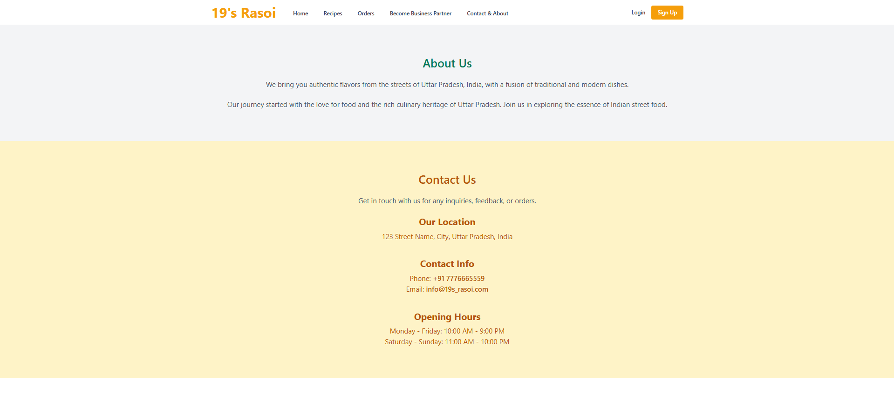
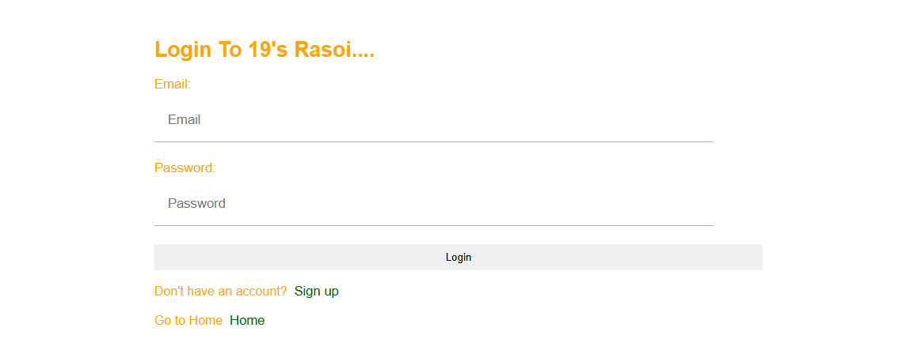
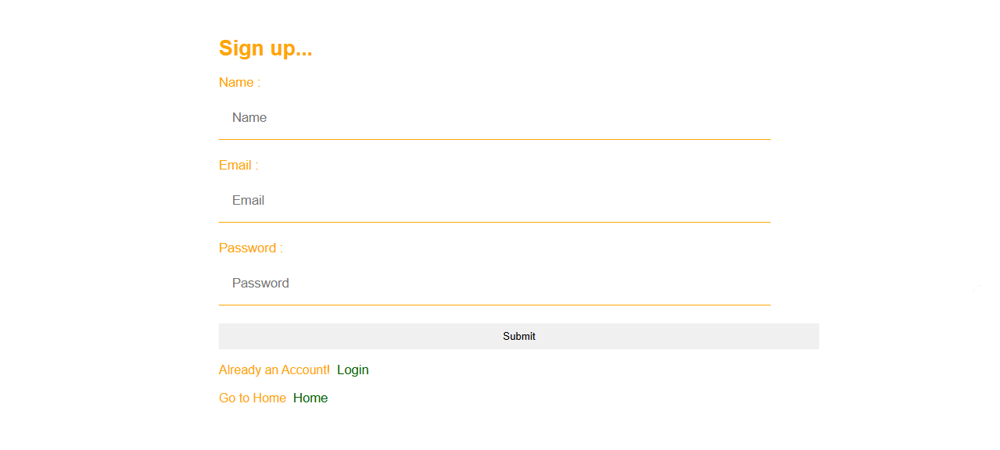

# 19sRasoi 🍽️

A simple Django-based web project styled using Tailwind CSS (via CDN). This is a frontend prototype of a food-related application with basic pages like Home, Contact, Login, and Signup.

---

## ✨ Features

- Tailwind CSS integrated using CDN  
- Django-powered templating and routing  
- Clean UI pages:
  - Home
  - Contact
  - Login
  - Signup

---

## 📷 Screenshots

| Page    | Screenshot                         |
|---------|------------------------------------|
| Home    |       |
| Contact | |
| Login   |     |
| Signup  |   |

Make sure screenshots are saved inside the `/screenshots` folder in the root directory.

---

## ⚙️ Tech Stack

- **Backend:** Django 5.2  
- **Frontend:** HTML5, Tailwind CSS (CDN)  
- **Language:** Python 3.12+

---

## 🚀 How to Run

1. **Install dependencies**  
   *(Make sure you're in a virtual environment)*  
   ```bash
   pip install -r requirements.txt


2. **Run the server**

   ```bash
   python manage.py runserver
   ```

3. **Open in browser**
   Visit: [http://127.0.0.1:8000](http://127.0.0.1:8000)

---

## 🧹 Clean Project (optional)

To remove `__pycache__` and `.pyc` files:

```powershell
Get-ChildItem -Recurse -Directory -Filter '__pycache__' | Remove-Item -Recurse -Force
Get-ChildItem -Recurse -Include *.pyc | Remove-Item -Force
```

---

## 📁 Folder Structure (basic overview)

```plaintext
19sRasoi/
│
├── core/            # Main app (views, models, templates)
├── 19sRasoi/        # Project settings & URL routing
├── templates/       # HTML files styled with Tailwind CDN
├── static/          # Static files (optional)
├── screenshots/     # UI screenshots for README
└── requirements.txt
```

---

## 📄 License

This project is for learning and personal use. You are free to modify and extend it as needed.

